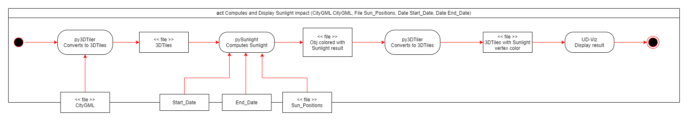

# pySunlight

<!-- TOC -->

- [pySunlight](#pysunlight)
- [About The Project](#about-the-project)
- [Getting Started](#getting-started)
  - [Dependencies](#dependencies)
  - [For Linux](#for-linux)
    - [Prerequisites](#prerequisites)
    - [Installation](#installation)
  - [For Mac OS](#for-mac-os)
    - [Prerequisites](#prerequisites-1)
    - [Installation](#installation-1)
  - [For Windows](#for-windows)
    - [Prerequisites](#prerequisites-2)
    - [Installation](#installation-2)
  - [Usage](#usage)
- [Contributing](#contributing)
  - [Coding Style](#coding-style)
  - [Pipeline - Activity Chart](#pipeline---activity-chart)
  - [Directory Hierarchy](#directory-hierarchy)
  - [License](#license)
- [Credits](#credits)
- [Acknowledgments](#acknowledgments)

<!-- /TOC -->

# About The Project

Light pre-calculation based on real data (urban data and sun position) with 3DTiles. pySunlight wrap the [Sunlight project](https://github.com/VCityTeam/Sunlight/tree/master) using
[SWIG](https://www.swig.org/) for its calculations to get the performance of c++ in python. Sunlight is present in a git submodule to ensure correct versions between the two projects.

# Getting Started

## Dependencies

- Python 3.9, only version supported by our dependency with [py3DTilers](https://github.com/VCityTeam/py3dtilers) (a 3DTiles parsers).
- PostgreSQL / PostGIS, as it's required by py3DTilers even if pySunlight doesn't use any database functionality.
- Same CMake version as [Sunlight](https://github.com/VCityTeam/Sunlight/blob/master/README.md) 3.27.
- [SWIG 4.0](https://www.swig.org/).

## For Linux

### Prerequisites

1. Install python 3.9.

   ```
   apt-get install python3.9 python3.9-dev
   ```

2. [Follow the install guide of PostgreSQL / PostGIS](https://github.com/VCityTeam/UD-SV/blob/master/Install/Setup_PostgreSQL_PostGIS_Ubuntu.md).

3. Install [libpq](https://www.postgresql.org/docs/9.5/libpq.html), the client interface with PostgreSQL in C (required by psycopg2 within py3dtilers).

   ```
   apt-get install -y libpq-dev
   ```

4. [Follow the SWIG install for Linux](https://github.com/VCityTeam/UD-SV/blob/master/Install/InstallSwig.md#for-linux).

### Installation

1. Clone the repository.

   ```
   git clone --recursive https://github.com/VCityTeam/pySunlight.git && cd pySunlight/
   ```

2. Create your virtual environment.

   ```
   python3.9 -m venv venv
   ```

3. Enable your virtual environment.

   ```
   . venv/bin/activate
   ```

4. Install all prerequisites.

   ```
   pip install -e .
   ```

## For Mac OS

### Prerequisites

**When using brew**

```bash
brew install python@3.9
brew install swig            # Assert you got version 4.X with "swig -verion"
```

Additionnaly, and because py3dTilers requires it (although pySunlight doesn't),

```bash
brew install postgresql@14
brew install postgis
```

**Without using brew**

1. Download and install python 3.9 from the [official website](https://www.python.org/downloads/macos/).

2. ⚠️ FIX ME : add PostgreSQL / PostGIS Mac os ?????

3. [Follow the SWIG install for Mac Os](https://github.com/VCityTeam/UD-SV/blob/master/Install/InstallSwig.md#for-mac-os).

### Installation

1. Clone the repository.

   ```
   git clone --recursive https://github.com/VCityTeam/pySunlight.git && cd pySunlight/
   ```

2. Create your virtual environment.

   ```
   python3.9 -m venv venv
   # Because venv doesn't seem to consider linking to the ad-hoc
   # version of python-config that is required by swig within the
   # cmake context at build time
   ln -s /usr/local/bin/python3.9-config venv/bin/python-config
   ```

3. Enable your virtual environment.

   ```
   . venv/bin/activate
   ```

4. Install all prerequisites.

   ```
   pip install -e .
   ```

## For Windows

### Prerequisites

1. Download and install python 3.9 from the [official website](https://www.python.org/downloads/windows/).

2. [Follow the install guide of PostgreSQL / PostGIS](https://github.com/VCityTeam/UD-SV/blob/master/ImplementationKnowHow/PostgreSQL_for_cityGML.md#1-download-postgresqlpostgis).

3. [Download CMake 3.27](https://cmake.org/download/).

4. [Follow the SWIG install for Windows](https://github.com/VCityTeam/UD-SV/blob/master/Install/InstallSwig.md#for-windows).

### Installation

1. Clone the repository.

   ```
   git clone --recursive https://github.com/VCityTeam/pySunlight.git && cd pySunlight/
   ```

2. Create your virtual environment.

   ```
   python3.9 -m venv venv
   ```

3. Enable your virtual environment.

   ```
   . venv/Scripts/activate
   ```

4. Install all prerequisites.

   ```
   pip install -e .
   ```

## Usage

1. You can create 3DTiles Sunlight using arguments, we are compatile with [Tileset Reader arguments](https://github.com/VCityTeam/py3dtilers/tree/master/py3dtilers/TilesetReader#tileset-reader) :

   ```
   python3.9 src/main.py -i "<INPUT_3DTILES_PATH>" -o "<OUTPUT_3DTILES_PATH>" --start-date <START_DATE> --end-date <START_DATE> 
   ```

The result will be the computation of sunlight between two dates and it will be exported in the output directory given.  

Here is a full list of all options available :
| Arguments             | Description                                                                                                           | Example          |
| --------------------- | --------------------------------------------------------------------------------------------------------------------- | ---------------- |
| --start-date, -s      | Start date of sunlight computation                                                                                    | -s 403224        |
| --end-date, -e        | End date of sunlight computation                                                                                      | -d 403248        |
| --with-aggregate      | Add aggregate to 3DTiles export, heavely impact performance                                                           | --with-aggregate |
| --log-level           | Provide logging level depending on [logging module](https://docs.python.org/3/howto/logging.html#when-to-use-logging) | --with-aggregate |

# Contributing

## Coding Style

1. Install the additional dev requirements.

   ```bash
   pip install -e .[dev]
   ```

2. To check if the code follows the coding style, run `flake8`

   ```bash
   flake8 .
   ```

3. To check the program, run at the root folder :

   ```bash
   pytest tests
   ```

5. Configure your IDE with [autopep8 formatting extension](https://marketplace.visualstudio.com/items?itemName=ms-python.autopep8).  
In VS Code, [follow this tutorial](https://www.digitalocean.com/community/tutorials/how-to-format-code-with-prettier-in-visual-studio-code)
by replacing prettier with [autopep8](https://marketplace.visualstudio.com/items?itemName=ms-python.autopep8).

## Pipeline - Activity Chart

Here is the pipeline we follow for pySunlight :


## Directory Hierarchy

```
pySunlight (repo)
├── datas                     # Datas use for testing
├── docs                      # Documentations (original charts...)
├── src                       # Source code
├── Sunlight                  # Sunlight repository as git submodule
├── tests                     # Unit tests
├── .flake8                   # Flake8 Configuration
├── .gitignore                # Files/folders ignored by Git
├── .gitmodules               # Sunlight module commit version
├── CMakeLists.txt            # CMake file to create a crossplatform software
├── README.md
├── pySunlight.i              # SWIG interface file to expose Sunlight in python
├── setup.py                  # Install python requirements
```

## License

Distributed under the LGPL-2.1 License. See `LICENSE` and `Libraries Licenses` for more information.

# Credits

- Wesley Petit - [Website](https://wesleypetit.fr/) - <wesley.petit.lemoine@gmail.com>

# Acknowledgments

- [Sunlight](https://github.com/VCityTeam/Sunlight)
- [py3DTilers](https://github.com/VCityTeam/py3dtilers/tree/master)
